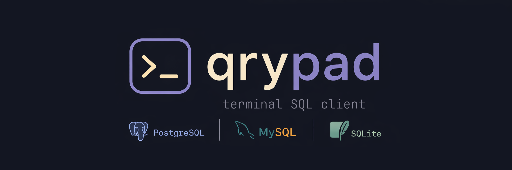
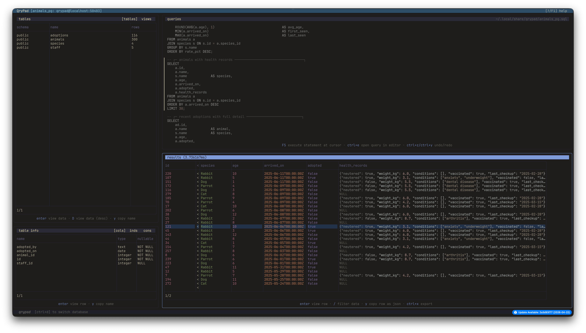

<p align="center">
  
</p>

A terminal SQL client for Postgres, MySQL and SQLite.

## Features

- Table / column autocomplete in the query pad
- Run the statement under the cursor
- Syntax highlighting
- Filter tables, columns and result sets
- View a snapshot of any table with a single keypress
- Browse tables, views, columns, indexes and constraints
- Switch between configured connections without restarting
- Switch databases on the current connection (Postgres / MySQL)
- Postgres schema support — switch schemas on the fly
- Inspect a full result row in a popup, with long values wrapped across lines
- Save and reload a query pad per connection, or open it in `$EDITOR`
- Export results to JSON or CSV
- Configurable key bindings and themes
- Passwords stored in the OS keychain

<p align="center">
  
</p>

## Installation

### Binary

https://github.com/wheelibin/qrypad/releases

### Go install

```
go install github.com/wheelibin/qrypad@latest
```

## Usage

```
qrypad
qrypad --connection <connection name>
```

`--connection` must match an entry in the config file. If omitted, you will be prompted to choose a connection on startup.

If the connection requires a password you will be prompted on first use; it is then stored in the OS keychain.

You can also switch connections from inside the app with `Ctrl+K`.

## Config

Config is read from `~/.config/qrypad/config.toml`.

### Example

```toml
# query timeout (seconds)
queryTimeout = 60

# max rows fetched when viewing table data (does not apply to ad-hoc queries)
tableDataRowLimit = 100

# show horizontal borders between table rows
rowBorders = true

[theme]
name = "catppuccin"

[connections]

[connections.animals]
driver = "mysql"
host = "localhost"
port = 3306
user = "root"
database = "animals.0"

[connections.music]
driver = "postgres"
host = "localhost"
port = 5432
user = "postgres"
database = "music-store"

[connections.orders]
driver = "sqlite"
database = "db/orders.db"
```

## Key bindings

<details>
    <summary>Default key bindings</summary>

### General

- `Tab` / `Shift+Tab` — switch panels
- `?` — show help
- `Ctrl+D` — switch database
- `Ctrl+K` — switch connection
- `Ctrl+P` — update stored password
- `Ctrl+B` — toggle the left (tables / info) panel
- `R` — refresh schema
- `/` — filter tables (`esc` to cancel)

### Tables panel

- `Enter` — fetch first N rows (`tableDataRowLimit`)
- `]` / `[` — switch tabs
- `y` — copy the selected table name

### Table info panel

- `]` / `[` — switch tabs
- `y` — copy the selected column / index name
- `/` — filter columns (`esc` to cancel)

### Query panel

- `F5` — run the statement at the cursor
- `Ctrl+Space` — autocomplete table / column
- `Ctrl+S` — save the query pad (per connection)
- `Ctrl+R` — reload the saved query pad from disk
- `Ctrl+E` — open the query pad in `$EDITOR`
- `Ctrl+Z` — undo
- `Ctrl+Y` — redo

### Results panel

- `Enter` — open the selected row in a popup
  - `y` — copy the selected value
- `y` — copy the selected row as JSON
- `/` — filter results (`esc` to cancel)

</details>

### Overriding key bindings

Any of the keys below can be overridden in the config file.

```toml
[keys]
AutoComplete     = ""
CopyValue        = ""
ExecuteQuery     = ""
Help             = ""
NextPanel        = ""
NextTab          = ""
OpenInEditor     = ""
PrevPanel        = ""
PrevTab          = ""
Redo             = ""
RefreshSchema    = ""
ReloadQuery      = ""
SaveQuery        = ""
SwitchConnection = ""
SwitchDatabase   = ""
ToggleLeftPanel  = ""
Undo             = ""
UpdatePassword   = ""
ViewData         = ""
ViewDataDesc     = ""
```

## Themes

### Built-in themes

- `kanagawa` (default)
- `catppuccin`
- `rose-pine`

Set the active theme in the config:

```toml
[theme]
name = "catppuccin"
```

### Customising themes

Override individual colours on top of an existing theme:

```toml
[theme]
name         = "catppuccin"
borderActive = { fg = "#ff00ff" }
```

Or define a new theme from scratch by giving it a new name and setting the colours:

```toml
[theme]
name                  = "my-custom-theme"
borderActive          = { bg = "", fg = "#ff00ff" }
currentStatement      = { bg = "", fg = "" }
databaseSwitcherPopup = { bg = "", fg = "" }
error                 = { bg = "", fg = "" }
helpPopup             = { bg = "", fg = "" }
helpKey               = { bg = "", fg = "" }
helpDesc              = { bg = "", fg = "" }
panelTitle            = { bg = "", fg = "" }
panelTitleActive      = { bg = "", fg = "" }
rowDetailsPopup       = { bg = "", fg = "" }
spinner               = { bg = "", fg = "" }
statusBar             = { bg = "", fg = "" }
tableBorder           = { bg = "", fg = "" }
tableHeader           = { bg = "", fg = "" }
text                  = { bg = "", fg = "" }
titleBar              = { bg = "", fg = "" }
titleBarAlt           = { bg = "", fg = "" }
syntaxKeyword         = { fg = "" }
syntaxString          = { fg = "" }
syntaxNumber          = { fg = "" }
syntaxComment         = { fg = "" }
syntaxOperator        = { fg = "" }
syntaxName            = { fg = "" }
syntaxLiteral         = { fg = "" }
syntaxPunctuation     = { fg = "" }
```

The `syntax*` keys control SQL syntax highlighting colours. If omitted, they fall back to colours derived from the UI theme.

## Contributing

See [CONTRIBUTING.md](CONTRIBUTING.md).
