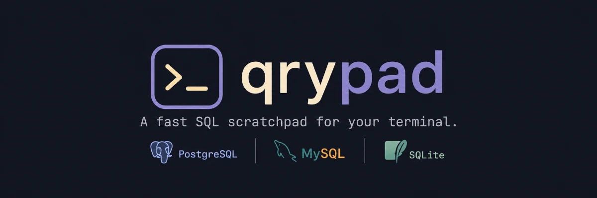

<p align="center">
  
</p>

<p align="center">
  <strong>A fast SQL scratchpad for your terminal.</strong>
  <br><br>
  Explore your schema, write and execute SQL, inspect results, and switch between
  sessions without leaving your terminal.
  <br><br>
  <strong>Postgres · MySQL · SQLite</strong>
</p>

<p align="center">
  
</p>

## Features

- Write SQL with syntax highlighting and table/column autocomplete
- Run the statement under the cursor — no selection needed
- Browse tables, views, columns, indexes, and constraints
- Snapshot any table with a single keypress
- Inspect and filter table data and query results
- Keep multiple database sessions open without losing your query pad or results
- Save query pads per connection, or edit them in `$EDITOR`
- Switch connections, databases, and Postgres schemas without restarting
- Export results to JSON or CSV
- Store passwords securely in the OS keychain

## Installation

### Binary

Download the latest release for macOS or Linux from
[GitHub Releases](https://github.com/wheelibin/qrypad/releases).

### Go

```sh
go install github.com/wheelibin/qrypad@latest
```

### Nix

```sh
nix run github:wheelibin/qrypad
```

Or install it:

```sh
nix profile install github:wheelibin/qrypad
```

## Usage

```sh
qrypad
```

Choose a configured connection on startup, or specify one directly:

```sh
qrypad --connection <name>
```

Passwords are prompted for on first use and stored in the OS keychain.

## Sessions

qrypad keeps database connections open as sessions. Each session retains its
connection, database, query pad, and results, so you can switch between databases
without losing your place or reconnecting.

- `Ctrl+L` — switch or close sessions
- `Ctrl+T` — toggle between the current and previous session
- `Ctrl+K` — open another connection

## Configuration

qrypad reads `~/.config/qrypad/config.toml`.

```toml
[connections.local]
driver = "postgres"
host = "localhost"
port = 5432
user = "postgres"
database = "mydb"
```

Supported drivers are `postgres`, `mysql`, and `sqlite`.

For SQLite:

```toml
[connections.local]
driver = "sqlite"
database = "db.sqlite"
```

## Key bindings

| Key                 | Action                      |
| ------------------- | --------------------------- |
| `Tab` / `Shift+Tab` | Switch panels               |
| `F5`                | Run statement at cursor     |
| `Ctrl+Space`        | Autocomplete                |
| `Ctrl+E`            | Open query pad in `$EDITOR` |
| `Ctrl+K`            | Open connection             |
| `Ctrl+L`            | Switch session              |
| `Ctrl+T`            | Toggle previous session     |
| `/`                 | Filter                      |
| `Enter`             | Inspect table / result row  |
| `?` / `F1`          | Help                        |

Key bindings are configurable in `config.toml`.

## Themes

qrypad includes `kanagawa` (default), `catppuccin`, and `rose-pine`.

```toml
[theme]
name = "catppuccin"
```

Themes and individual colours can be customised in `config.toml`.

## Contributing

See [CONTRIBUTING.md](CONTRIBUTING.md).

## License

Released under the [MIT License](LICENSE).
